# Dataset Quality Report

## Overview

### Dataset Statistics

| Metric | Value |
|--------|-------|
| Number of variables | 12 |
| Number of observations | 891 |
| Missing cells | 866 |
| Missing cells (%) | 8.1% |
| Duplicate rows | 0 |
| Duplicate rows (%) | 0.0% |
| Total size in memory | 315.0 KiB |
| Average record size | 362.1 B |

### Variable Types

| Type | Count |
|------|-------|
| Numeric | 3 |
| Categorical | 6 |
| Text | 3 |

## Alerts

**Critical Issues:** 2 | **Warnings:** 17

### Missing

- **77.1% missing values in 'Cabin'**
- Missingness in 'Age' correlates with 6 columns (Pclass, Parch, Embarked)
- Missingness in 'Cabin' correlates with 6 columns (Pclass, Fare, Survived)

### High Cardinality

- **Column 'Name' has 891 unique values (100.0% of rows)**
- Column 'Ticket' has 681 unique values (76.4% of rows)
- Column 'Cabin' has 147 unique values (16.5% of rows)

### Outliers

- Column 'SibSp' has 12 potential outliers (1.3% of non-missing values)
- Column 'Parch' has 10 potential outliers (1.1% of non-missing values)
- Column 'Fare' has 11 potential outliers (1.2% of non-missing values)

### Zeros

- Column 'Survived' has 61.6% zero values
- Column 'SibSp' has 68.2% zero values
- Column 'Parch' has 76.1% zero values

### Skewness

- Column 'SibSp' is highly skewed (skewness: 3.70)
- Column 'Fare' is highly skewed (skewness: 4.79)

### Uniform

- 'PassengerId' is uniformly distributed and monotonic

### Unique

- 'PassengerId' has unique values
- 'Name' has unique values

### Constant Length

- 'Embarked' has constant length (1 chars for 100.0% of values)

### High Correlation

- Categorical columns 'Survived' and 'Sex' highly associated (Cramer's V: 0.540)

## Reproduction

| Property | Value |
|----------|-------|
| Analysis started | 2026-02-08T11:43:39 |
| Analysis finished | 2026-02-08T11:43:48 |
| Duration | 8.64 seconds |
| Software version | hashprep v0.1.0a4 |

## Variable Analysis

### PassengerId
`Numeric` `Unique`

| Metric | Value |
|--------|-------|
| Distinct | 891 (100.0%) |
| Missing | 0 (0.0%) |
| Mean | 446 |
| Min | 1 |
| Max | 891 |
| Memory | 7.1 KiB |

#### Quantile Statistics

| Statistic | Value |
|-----------|-------|
| Minimum | 1 |
| 5th percentile | 45.5 |
| Q1 (25%) | 223.5 |
| Median (50%) | 446 |
| Q3 (75%) | 668.5 |
| 95th percentile | 846.5 |
| Maximum | 891 |
| Range | 890 |
| IQR | 445 |

#### Descriptive Statistics

| Statistic | Value |
|-----------|-------|
| Mean | 446 |
| Std deviation | 257.354 |
| Variance | 66231 |
| CV | 0.577027 |
| Skewness | 0 |
| Kurtosis | -1.2 |
| MAD | 223 |
| Sum | 397386 |
| Monotonicity | Increasing |

#### Common Values

| Value | Count | % |
|-------|------:|----:|
| 891 | 1 | 0.1% |
| 1 | 1 | 0.1% |
| 2 | 1 | 0.1% |
| 3 | 1 | 0.1% |
| 4 | 1 | 0.1% |
| 5 | 1 | 0.1% |
| 6 | 1 | 0.1% |
| 7 | 1 | 0.1% |
| 8 | 1 | 0.1% |
| 9 | 1 | 0.1% |

#### Extreme Values

**Minimum 10:** `1, 2, 3, 4, 5, 6, 7, 8, 9, 10`

**Maximum 10:** `882, 883, 884, 885, 886, 887, 888, 889, 890, 891`

#### Value Counts

| Type | Count | % |
|------|------:|----:|
| Zeros | 0 | 0.0% |
| Negative | 0 | 0.0% |
| Infinite | 0 | 0.0% |

#### Visualizations

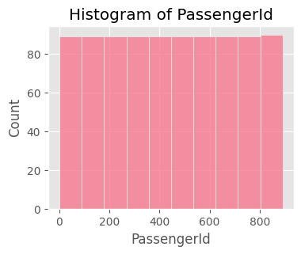

---

### Survived
`Categorical`

| Metric | Value |
|--------|-------|
| Distinct | 2 (0.2%) |
| Missing | 0 (0.0%) |
| Memory | 7.1 KiB |
| Min length | 1 |
| Max length | 1 |
| Mean length | 1.00 |

#### Character Statistics

| Statistic | Value |
|-----------|-------|
| Total characters | 891 |
| Distinct characters | 2 |
| Distinct categories | 1 |

#### Visualizations

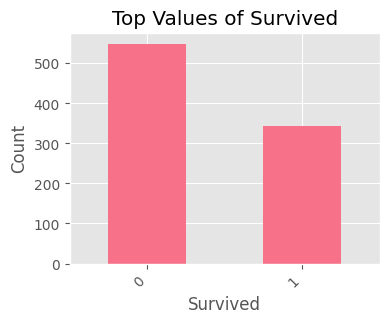

---

### Pclass
`Categorical`

| Metric | Value |
|--------|-------|
| Distinct | 3 (0.3%) |
| Missing | 0 (0.0%) |
| Memory | 7.1 KiB |
| Min length | 1 |
| Max length | 1 |
| Mean length | 1.00 |

#### Character Statistics

| Statistic | Value |
|-----------|-------|
| Total characters | 891 |
| Distinct characters | 3 |
| Distinct categories | 1 |

#### Visualizations

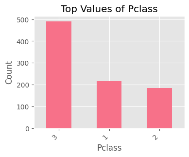

---

### Name
`Text` `Unique`

| Metric | Value |
|--------|-------|
| Distinct | 891 (100.0%) |
| Missing | 0 (0.0%) |
| Memory | 73.2 KiB |
| Min length | 12 |
| Max length | 82 |
| Mean length | 26.97 |

#### Character Statistics

| Statistic | Value |
|-----------|-------|
| Total characters | 24026 |
| Distinct characters | 60 |
| Distinct categories | 7 |

#### Visualizations

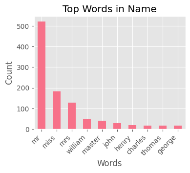

---

### Sex
`Categorical`

| Metric | Value |
|--------|-------|
| Distinct | 2 (0.2%) |
| Missing | 0 (0.0%) |
| Memory | 53.8 KiB |
| Min length | 4 |
| Max length | 6 |
| Mean length | 4.70 |

#### Character Statistics

| Statistic | Value |
|-----------|-------|
| Total characters | 4192 |
| Distinct characters | 5 |
| Distinct categories | 1 |

#### Visualizations

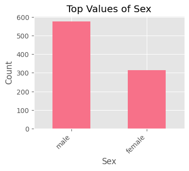

---

### Age
`Numeric` `19.9% missing`

| Metric | Value |
|--------|-------|
| Distinct | 88 (12.3%) |
| Missing | 177 (19.9%) |
| Mean | 29.6991 |
| Min | 0.42 |
| Max | 80 |
| Memory | 7.1 KiB |

#### Quantile Statistics

| Statistic | Value |
|-----------|-------|
| Minimum | 0.42 |
| 5th percentile | 4 |
| Q1 (25%) | 20.125 |
| Median (50%) | 28 |
| Q3 (75%) | 38 |
| 95th percentile | 56 |
| Maximum | 80 |
| Range | 79.58 |
| IQR | 17.875 |

#### Descriptive Statistics

| Statistic | Value |
|-----------|-------|
| Mean | 29.6991 |
| Std deviation | 14.5265 |
| Variance | 211.019 |
| CV | 0.489122 |
| Skewness | 0.389108 |
| Kurtosis | 0.178274 |
| MAD | 9 |
| Sum | 21205.2 |
| Monotonicity | None |

#### Common Values

| Value | Count | % |
|-------|------:|----:|
| 24.0 | 30 | 4.2% |
| 22.0 | 27 | 3.8% |
| 18.0 | 26 | 3.6% |
| 28.0 | 25 | 3.5% |
| 30.0 | 25 | 3.5% |
| 19.0 | 25 | 3.5% |
| 21.0 | 24 | 3.4% |
| 25.0 | 23 | 3.2% |
| 36.0 | 22 | 3.1% |
| 29.0 | 20 | 2.8% |

#### Extreme Values

**Minimum 10:** `0.42, 0.67, 0.75, 0.75, 0.83, 0.83, 0.92, 1, 1, 1`

**Maximum 10:** `65, 65, 66, 70, 70, 70.5, 71, 71, 74, 80`

#### Value Counts

| Type | Count | % |
|------|------:|----:|
| Zeros | 0 | 0.0% |
| Negative | 0 | 0.0% |
| Infinite | 0 | 0.0% |

#### Visualizations

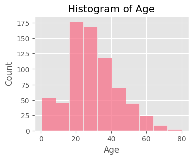

---

### SibSp
`Categorical`

| Metric | Value |
|--------|-------|
| Distinct | 7 (0.8%) |
| Missing | 0 (0.0%) |
| Memory | 7.1 KiB |
| Min length | 1 |
| Max length | 1 |
| Mean length | 1.00 |

#### Character Statistics

| Statistic | Value |
|-----------|-------|
| Total characters | 891 |
| Distinct characters | 7 |
| Distinct categories | 1 |

#### Visualizations

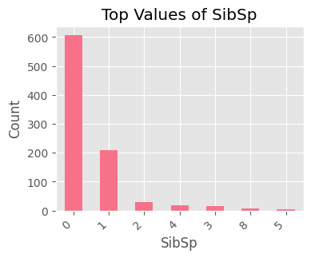

---

### Parch
`Categorical`

| Metric | Value |
|--------|-------|
| Distinct | 7 (0.8%) |
| Missing | 0 (0.0%) |
| Memory | 7.1 KiB |
| Min length | 1 |
| Max length | 1 |
| Mean length | 1.00 |

#### Character Statistics

| Statistic | Value |
|-----------|-------|
| Total characters | 891 |
| Distinct characters | 7 |
| Distinct categories | 1 |

#### Visualizations

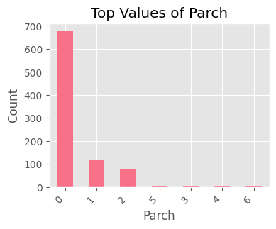

---

### Ticket
`Text`

| Metric | Value |
|--------|-------|
| Distinct | 681 (76.4%) |
| Missing | 0 (0.0%) |
| Memory | 55.6 KiB |
| Min length | 3 |
| Max length | 18 |
| Mean length | 6.75 |

#### Character Statistics

| Statistic | Value |
|-----------|-------|
| Total characters | 6015 |
| Distinct characters | 35 |
| Distinct categories | 5 |

#### Visualizations

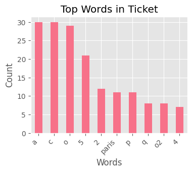

---

### Fare
`Numeric`

| Metric | Value |
|--------|-------|
| Distinct | 248 (27.8%) |
| Missing | 0 (0.0%) |
| Mean | 32.2042 |
| Min | 0 |
| Max | 512.329 |
| Memory | 7.1 KiB |

#### Quantile Statistics

| Statistic | Value |
|-----------|-------|
| Minimum | 0 |
| 5th percentile | 7.225 |
| Q1 (25%) | 7.9104 |
| Median (50%) | 14.4542 |
| Q3 (75%) | 31 |
| 95th percentile | 112.079 |
| Maximum | 512.329 |
| Range | 512.329 |
| IQR | 23.0896 |

#### Descriptive Statistics

| Statistic | Value |
|-----------|-------|
| Mean | 32.2042 |
| Std deviation | 49.6934 |
| Variance | 2469.44 |
| CV | 1.54307 |
| Skewness | 4.78732 |
| Kurtosis | 33.3981 |
| MAD | 6.9042 |
| Sum | 28693.9 |
| Monotonicity | None |

#### Common Values

| Value | Count | % |
|-------|------:|----:|
| 8.05 | 43 | 4.8% |
| 13.0 | 42 | 4.7% |
| 7.8958 | 38 | 4.3% |
| 7.75 | 34 | 3.8% |
| 26.0 | 31 | 3.5% |
| 10.5 | 24 | 2.7% |
| 7.925 | 18 | 2.0% |
| 7.775 | 16 | 1.8% |
| 7.2292 | 15 | 1.7% |
| 26.55 | 15 | 1.7% |

#### Extreme Values

**Minimum 10:** `0, 0, 0, 0, 0, 0, 0, 0, 0, 0`

**Maximum 10:** `247.5, 262.4, 262.4, 263, 263, 263, 263, 512.3, 512.3, 512.3`

#### Value Counts

| Type | Count | % |
|------|------:|----:|
| Zeros | 15 | 1.7% |
| Negative | 0 | 0.0% |
| Infinite | 0 | 0.0% |

#### Visualizations

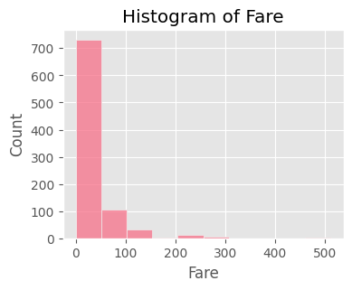

---

### Cabin
`Text` `77.1% missing`

| Metric | Value |
|--------|-------|
| Distinct | 147 (72.1%) |
| Missing | 687 (77.1%) |
| Memory | 33.7 KiB |
| Min length | 1 |
| Max length | 15 |
| Mean length | 3.59 |

#### Character Statistics

| Statistic | Value |
|-----------|-------|
| Total characters | 732 |
| Distinct characters | 19 |
| Distinct categories | 3 |

#### Visualizations

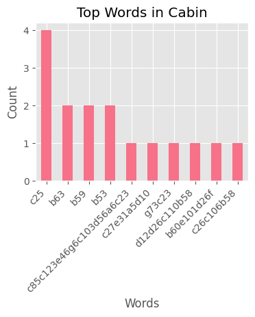

---

### Embarked
`Categorical` `0.2% missing`

| Metric | Value |
|--------|-------|
| Distinct | 3 (0.3%) |
| Missing | 2 (0.2%) |
| Memory | 50.5 KiB |
| Min length | 1 |
| Max length | 1 |
| Mean length | 1.00 |

#### Character Statistics

| Statistic | Value |
|-----------|-------|
| Total characters | 889 |
| Distinct characters | 3 |
| Distinct categories | 1 |

#### Visualizations

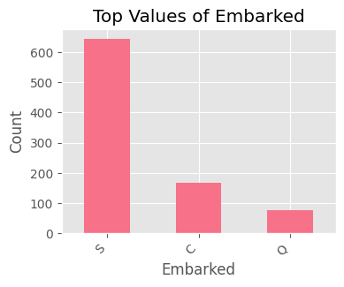

---

## Correlations

### Numeric (Pearson - Top pairs)

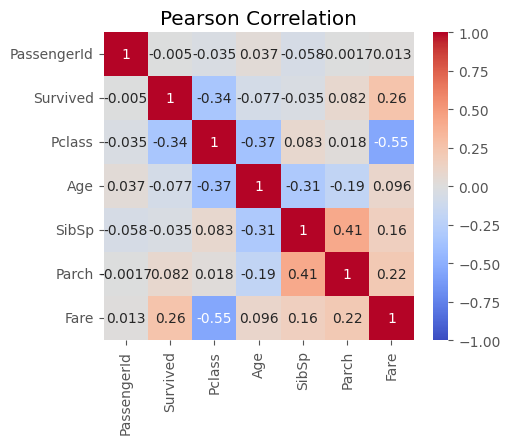

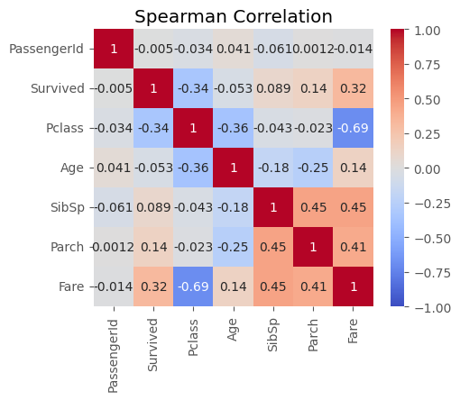

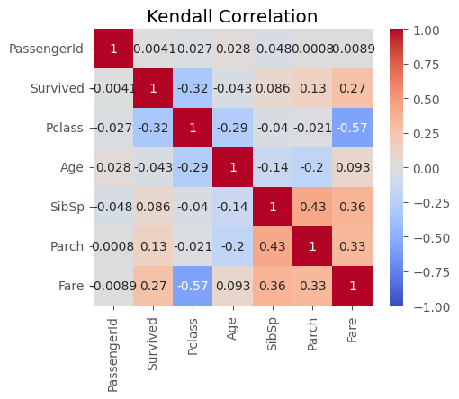

| Feature 1 | Feature 2 | Correlation |
|---|---|---|
| Fare | Pclass | -0.549 |
| Parch | SibSp | 0.415 |
| Age | Pclass | -0.369 |
| Pclass | Survived | -0.338 |
| Age | SibSp | -0.308 |
| Fare | Survived | 0.257 |
| Fare | Parch | 0.216 |
| Age | Parch | -0.189 |
| Fare | SibSp | 0.160 |
| Age | Fare | 0.096 |

### Categorical (Cramer's V)

| Pair | Value |
|---|---|
| Name__Sex | 1.00 |
| Name__Embarked | 1.00 |
| Name__Cabin | 1.00 |
| Name__Ticket | 1.00 |
| Ticket__Embarked | 1.00 |
| Ticket__Cabin | 0.95 |
| Cabin__Embarked | 0.95 |
| Sex__Ticket | 0.86 |
| Sex__Cabin | 0.86 |
| Sex__Embarked | 0.12 |

## Missing Values

| Column | Count | Percentage |
|--------|-------|------------|
| Age | 177 | 19.87% |
| Cabin | 687 | 77.10% |
| Embarked | 2 | 0.22% |

## Dataset Preview

### Head (first 5 rows)

|   PassengerId |   Survived |   Pclass | Name                                                | Sex    |   Age |   SibSp |   Parch | Ticket           |    Fare | Cabin   | Embarked   |
|--------------:|-----------:|---------:|:----------------------------------------------------|:-------|------:|--------:|--------:|:-----------------|--------:|:--------|:-----------|
|             1 |          0 |        3 | Braund, Mr. Owen Harris                             | male   |    22 |       1 |       0 | A/5 21171        |  7.25   |         | S          |
|             2 |          1 |        1 | Cumings, Mrs. John Bradley (Florence Briggs Thayer) | female |    38 |       1 |       0 | PC 17599         | 71.2833 | C85     | C          |
|             3 |          1 |        3 | Heikkinen, Miss. Laina                              | female |    26 |       0 |       0 | STON/O2. 3101282 |  7.925  |         | S          |
|             4 |          1 |        1 | Futrelle, Mrs. Jacques Heath (Lily May Peel)        | female |    35 |       1 |       0 | 113803           | 53.1    | C123    | S          |
|             5 |          0 |        3 | Allen, Mr. William Henry                            | male   |    35 |       0 |       0 | 373450           |  8.05   |         | S          |

### Random Sample (10 rows)

|   PassengerId |   Survived |   Pclass | Name                                              | Sex    |   Age |   SibSp |   Parch | Ticket           |    Fare | Cabin   | Embarked   |
|--------------:|-----------:|---------:|:--------------------------------------------------|:-------|------:|--------:|--------:|:-----------------|--------:|:--------|:-----------|
|           710 |          1 |        3 | Moubarek, Master. Halim Gonios ("William George") | male   |   nan |       1 |       1 | 2661             | 15.2458 |         | C          |
|           440 |          0 |        2 | Kvillner, Mr. Johan Henrik Johannesson            | male   |    31 |       0 |       0 | C.A. 18723       | 10.5    |         | S          |
|           841 |          0 |        3 | Alhomaki, Mr. Ilmari Rudolf                       | male   |    20 |       0 |       0 | SOTON/O2 3101287 |  7.925  |         | S          |
|           721 |          1 |        2 | Harper, Miss. Annie Jessie "Nina"                 | female |     6 |       0 |       1 | 248727           | 33      |         | S          |
|            40 |          1 |        3 | Nicola-Yarred, Miss. Jamila                       | female |    14 |       1 |       0 | 2651             | 11.2417 |         | C          |
|           291 |          1 |        1 | Barber, Miss. Ellen "Nellie"                      | female |    26 |       0 |       0 | 19877            | 78.85   |         | S          |
|           301 |          1 |        3 | Kelly, Miss. Anna Katherine "Annie Kate"          | female |   nan |       0 |       0 | 9234             |  7.75   |         | Q          |
|           334 |          0 |        3 | Vander Planke, Mr. Leo Edmondus                   | male   |    16 |       2 |       0 | 345764           | 18      |         | S          |
|           209 |          1 |        3 | Carr, Miss. Helen "Ellen"                         | female |    16 |       0 |       0 | 367231           |  7.75   |         | Q          |
|           137 |          1 |        1 | Newsom, Miss. Helen Monypeny                      | female |    19 |       0 |       2 | 11752            | 26.2833 | D47     | S          |

### Tail (last 5 rows)

|   PassengerId |   Survived |   Pclass | Name                                     | Sex    |   Age |   SibSp |   Parch | Ticket     |   Fare | Cabin   | Embarked   |
|--------------:|-----------:|---------:|:-----------------------------------------|:-------|------:|--------:|--------:|:-----------|-------:|:--------|:-----------|
|           887 |          0 |        2 | Montvila, Rev. Juozas                    | male   |    27 |       0 |       0 | 211536     |  13    |         | S          |
|           888 |          1 |        1 | Graham, Miss. Margaret Edith             | female |    19 |       0 |       0 | 112053     |  30    | B42     | S          |
|           889 |          0 |        3 | Johnston, Miss. Catherine Helen "Carrie" | female |   nan |       1 |       2 | W./C. 6607 |  23.45 |         | S          |
|           890 |          1 |        1 | Behr, Mr. Karl Howell                    | male   |    26 |       0 |       0 | 111369     |  30    | C148    | C          |
|           891 |          0 |        3 | Dooley, Mr. Patrick                      | male   |    32 |       0 |       0 | 370376     |   7.75 |         | Q          |

---
Generated by HashPrep
